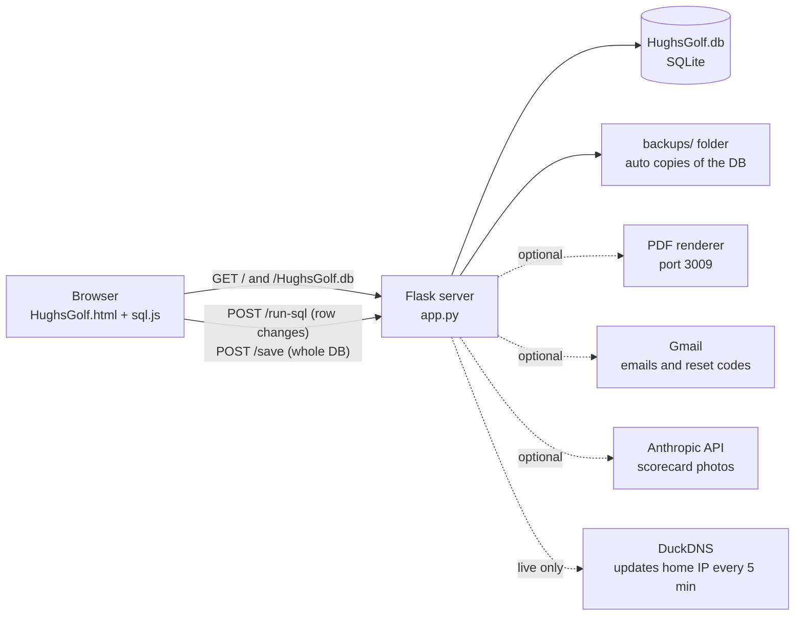
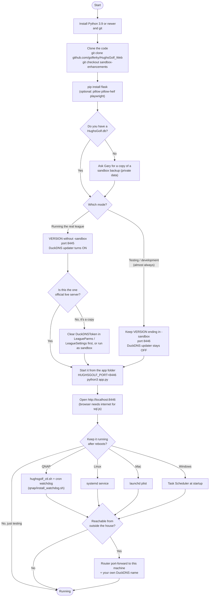

# Running HughsGolf on your own machine or server

How the app is put together, what you need, and the steps to get a copy running on a laptop, a QNAP, or any Linux, Mac, or Windows server.
Written against version 20260926.12 on the `sandbox-enhancements` branch. QNAP-specific details are in [qnap/README.md](../qnap/README.md).

## How it fits together

HughsGolf is one small Python server and one big web page. The server hands the page and the SQLite database file to the browser; the browser does almost all of the work (scores, skins, standings) and sends changes back to the server one SQL statement at a time.



## Setup flowchart

Follow it top to bottom. The two decisions that matter most: which mode you run in, and whether your copy is allowed to touch the league's DuckDNS address.



## What you need

| Piece | Needed? | Used for |
|---|---|---|
| Python 3.9+ | **Required** | Runs `app.py`. 3.9 is the minimum because of `zoneinfo` (league times are US Eastern). |
| Flask | **Required** | The web server. `pip install flask` |
| `HughsGolf.html`, `app.py` | **Required** | The whole app. Keep them in the same folder. |
| `HughsGolf.db` | **Required** | SQLite database, same folder as `app.py`. Contains player names, emails, phones and league money, so share it privately. |
| Internet in the browser | **Required** | The page loads sql.js (SQLite for the browser) from cdnjs.cloudflare.com. |
| Pillow, pillow-heif | Optional | Reading iPhone photos for Import Round from a scorecard picture. |
| Anthropic API key | Optional | Scorecard photo parsing. Stored as `AnthropicApiKey`, or `ANTHROPIC_API_KEY` env var, or `anthropic_key.txt`. |
| Gmail address + app password | Optional | Password resets, sub requests, PDF reports by email. Stored in `LeagueSettings` / `LeagueParms`. |
| PDF renderer (port 3009) or Playwright | Optional | HTML-to-PDF reports. On the QNAP this is the `hughsgolf-pdf` Docker container; elsewhere `pip install playwright` works as a fallback. |
| DuckDNS token | Live only | Keeps `hughsgolf.duckdns.org` pointed at the league's home IP. Only the official live server should have it. |

## Quick start on a laptop

Works the same on Mac, Linux, and Windows (use `py` instead of `python3` on Windows).

```bash
git clone https://github.com/golferky/HughsGolf_Web.git
cd HughsGolf_Web
git checkout sandbox-enhancements
python3 -m pip install flask
# put the HughsGolf.db you were given in this folder, then:
HUGHSGOLF_PORT=8446 python3 app.py          # Mac / Linux
# set HUGHSGOLF_PORT=8446 && py app.py       # Windows cmd
```

Open `http://localhost:8446`. On `localhost` the page shows a red **TEST** banner and unlocks test tools (future-date scores, seed buttons). That is expected for a developer copy.

## Settings the server reads

| Setting | Default | What it does |
|---|---|---|
| `VERSION` in app.py | ends in `-sandbox` | Decides the mode. With `-sandbox`: sandbox backups, Compare Live allowed, DuckDNS updater off. Without it: live backups and DuckDNS updater on. |
| `HUGHSGOLF_PORT` | 8446 | Port to listen on. The league uses 8445 for live and 8446 for sandbox. |
| `HUGHSGOLF_LOG` | flask_garyadmin.log | Where the in-app log viewer reads from. |
| `HUGHSGOLF_LIVE_DB`, `HUGHSGOLF_LIVE_URL` | league's own paths | Sandbox only: where Compare Live and Refresh-from-live get the live data. Point them at your own live copy, or ignore. |
| `HUGHSGOLF_PDF_RENDERER_URL` | http://127.0.0.1:3009/render | PDF service. If it isn't there, Playwright is tried instead. |
| `update_notice.txt` | none | Put a line of text in this file next to app.py and it shows as a yellow notice on the login screen and under the tabs. Delete it to hide. |

How the page decides what it is: port 8445 is always treated as live and 8446 as sandbox. Any other port on `localhost` or a `192.168.x.x` address is treated as a local test copy.

## Keeping it running

**QNAP (how the league runs).** Folders `…/HughsGolf/live` and `…/HughsGolf/sandbox`, one Python per folder.

```bash
sh hughsgolf_ctl.sh live restart
sh hughsgolf_ctl.sh all status
sudo sh install_watchdog.sh
```

The watchdog checks every minute and starts a site that is down. On a different QNAP, edit `BASE`, `PYTHON` and `RUN_AS` at the top of `qnap/hughsgolf_ctl.sh`.

**Linux server.** A systemd unit, for example `/etc/systemd/system/hughsgolf.service`:

```ini
[Service]
WorkingDirectory=/srv/hughsgolf
Environment=HUGHSGOLF_PORT=8446
ExecStart=/usr/bin/python3 -u app.py
Restart=always
User=hughsgolf
[Install]
WantedBy=multi-user.target
```

Then `systemctl enable --now hughsgolf`.

**Mac.** A launchd plist in `~/Library/LaunchAgents` that runs `python3 -u app.py` with `KeepAlive` on. The repo's `make_plist.py` writes one.

**Windows.** Task Scheduler, trigger "At startup", action `py -u app.py`, "Start in" set to the app folder.

## Deploying updates

1. Change the code, bump the version in **both** places (`APP_VERSION` in HughsGolf.html and `VERSION` in app.py), commit and push.
2. On the league's QNAP: `./deploy_qnap.sh sandbox`, test, then `./deploy_qnap.sh live`. The script refuses to deploy anything that isn't committed and pushed, backs up the live database first, and checks `/version` afterward.
3. On any other server: `git pull` in the app folder, then restart the service. Copy only `HughsGolf.html` and `app.py`; never copy a database over a running live site.

## Before you share or open it up

> **A copy must never run as live with the league's DuckDNS token.**
> A live-mode server updates `hughsgolf.duckdns.org` every 5 minutes to its own public IP. A second live copy would pull the league's address to someone else's house. Run copies as sandbox, or blank the token in the database first.

- The browser downloads the whole `HughsGolf.db`, so anyone who can open the site can get the file, including the Gmail app password and DuckDNS token stored in it. Keep public copies behind your own network, or strip those values from the database you share.
- Writes are protected only by a shared token built into `app.py` (`SAVE_TOKEN`), and the server hands that token to any browser that asks (`/save-token`). Treat any copy reachable from the internet as writable by anyone who can open it; keep test copies on your own network.
- The server makes rolling backups in `backups/live` or `backups/sandbox` and a copy before every live deploy in `backups/predeploy`. Include that folder in your own backups.
